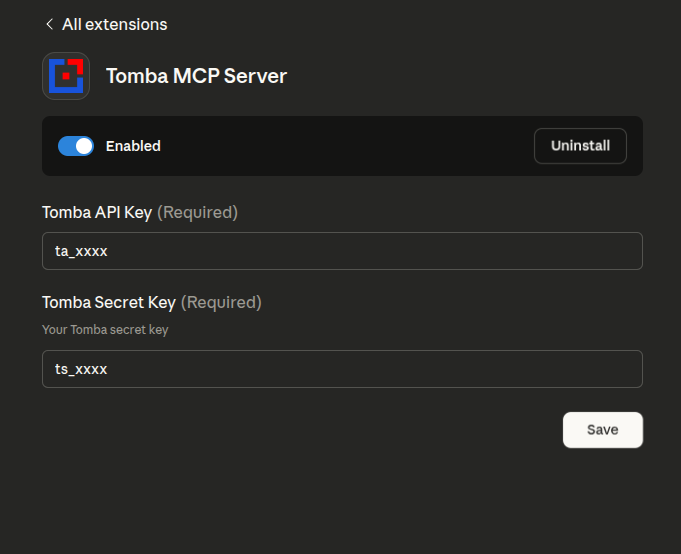
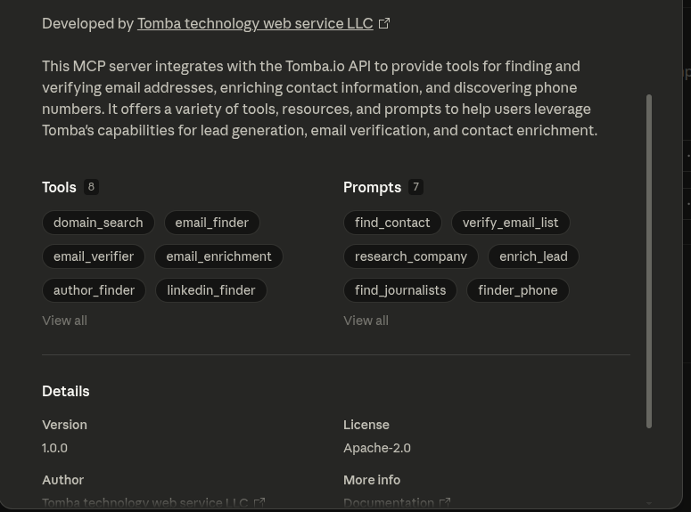
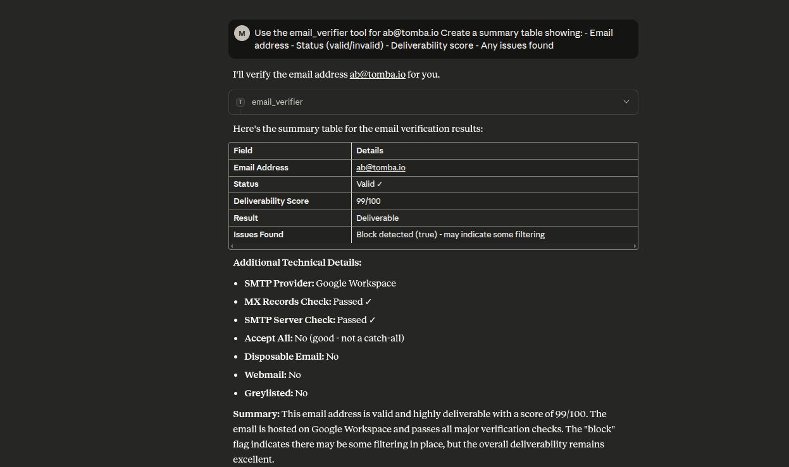
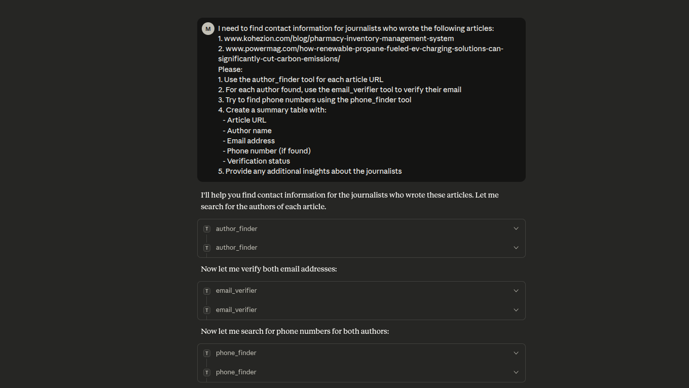
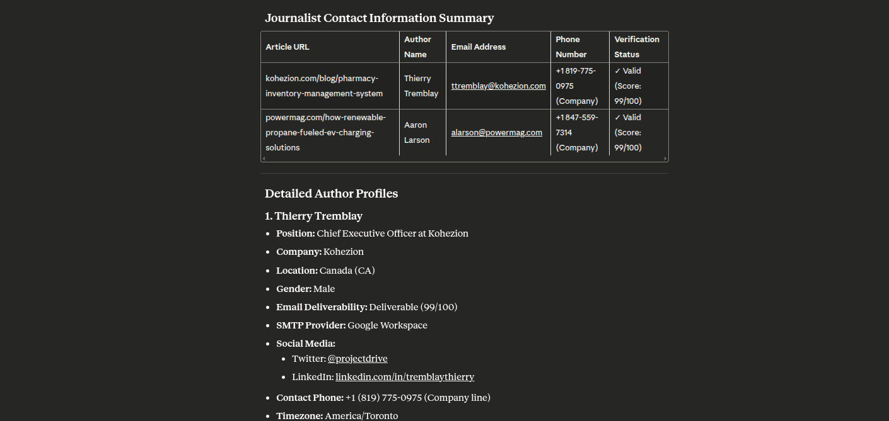

# [](https://tomba.io/) Tomba.io MCP Server

A Model Context Protocol (MCP) server for integrating with the Tomba.io API. This server provides comprehensive email discovery, verification, and enrichment capabilities through a standardized MCP interface.

## Features

### Tools (12 available)

- **[Domain Search](https://tomba.io/domain-search)**: Find all email addresses associated with a domain
- **[Email Finder](https://tomba.io/email-finder)**: Generate likely email addresses from names and domains
- **[Email Verifier](https://tomba.io/email-verifier)**: Verify email deliverability and check database presence
- **[Email Enrichment](https://tomba.io/enrichment)**: Enrich emails with additional contact data
- **[Author Finder](https://tomba.io/author-finder)**: Discover email addresses of article authors
- **[LinkedIn Finder](https://tomba.io/linkedin-finder)**: Find emails from LinkedIn profile URLs
- **[Phone Finder](https://tomba.io/phone-finder)**: Search phone numbers by email, domain, or LinkedIn
- **[Phone Validator](https://tomba.io/phone-validator)**: Validate phone numbers and check carrier info
- **[Email Count](https://tomba.io/email-count)**: Get total email counts for domains
- **[Similar Finder](https://tomba.io/similar-domains)**: Find similar domains based on a target domain
- **[Technology Finder](https://tomba.io/technology-finder)**: Discover technology stacks used by websites
- **[Companies Search](https://app.tomba.io/reveal)**: Search for companies using natural language queries with advanced filters

### Resources (7 available)

- `tomba://api/status` - API status and account info
- `tomba://domain/{domain}` - Domain information
- `tomba://email/{email}` - Email information
- `tomba://similar/{domain}` - Similar domains analysis
- `tomba://technology/{domain}` - Technology stack information
- `tomba://docs/api` - API documentation
- `tomba://docs/tools` - Tools documentation

### Prompts (16 pre-built workflows)

- **find_contact** - Find complete contact info for a person
- **verify_email_list** - Batch verify email addresses
- **research_company** - Research company contacts and structure
- **enrich_lead** - Enrich a lead with all available data
- **find_journalists** - Find journalist contacts from articles
- **finder_phone** - Find phone numbers for contacts
- **validate_phone** - Validate a phone number
- **competitor_analysis** - Analyze competitors using similar domains and technology
- **technology_audit** - Comprehensive technology audit of a website
- **domain_insights** - Get comprehensive insights about a domain including email count and technology
- **bulk_domain_research** - Research multiple domains for email counts and basic information
- **find_target_companies** - Find companies matching specific criteria using natural language search
- **market_research** - Research companies in a specific market segment
- **lead_generation** - Generate leads by finding companies and their contacts
- **prospect_enrichment** - Enrich company prospects with comprehensive data
- **industry_analysis** - Analyze companies within a specific industry and location

### Transport Options

- **stdio** - Standard input/output (default, for Claude Desktop)
- **http** - HTTP server with REST endpoints

## Installation

### Prerequisites

- Node.js 18 or higher
- npm or yarn
- Tomba API account ([Sign up here](https://tomba.io))

## Screenshots







### Option 1: Install via NPX (Recommended)

The easiest way to use the Tomba MCP server is via npx, which doesn't require cloning the repository:

#### macOS/Linux

Add to your `claude_desktop_config.json` (`~/Library/Application Support/Claude/claude_desktop_config.json`):

```json
{
    "mcpServers": {
        "tomba": {
            "command": "npx",
            "args": ["-y", "tomba-mcp-server"],
            "env": {
                "TOMBA_API_KEY": "your-api-key-here",
                "TOMBA_SECRET_KEY": "your-secret-key-here"
            }
        }
    }
}
```

#### Windows

Add to your `claude_desktop_config.json` (`%APPDATA%\Claude\claude_desktop_config.json`):

```json
{
    "mcpServers": {
        "tomba": {
            "command": "npx",
            "args": ["-y", "tomba-mcp-server"],
            "env": {
                "TOMBA_API_KEY": "your-api-key-here",
                "TOMBA_SECRET_KEY": "your-secret-key-here"
            }
        }
    }
}
```

**Note:** The `-y` flag automatically accepts the installation prompt, and npx will always fetch the latest version.

### Option 2: Install from Source

If you want to modify the server or contribute to development:

```bash
# Clone the repository
git clone https://github.com/tomba-io/tomba-mcp-server.git
cd tomba-mcp-server

# Install dependencies
yarn install

# Build the project
yarn build
```

## Configuration

### Claude Desktop Setup

To use this server with Claude Desktop, add the configuration to your `claude_desktop_config.json` file.

#### Using NPX (Recommended)

This method automatically uses the latest published version:

**macOS/Linux** (`~/Library/Application Support/Claude/claude_desktop_config.json`):

```json
{
    "mcpServers": {
        "tomba": {
            "command": "npx",
            "args": ["-y", "tomba-mcp-server"],
            "env": {
                "TOMBA_API_KEY": "your-api-key-here",
                "TOMBA_SECRET_KEY": "your-secret-key-here"
            }
        }
    }
}
```

**Windows** (`%APPDATA%\Claude\claude_desktop_config.json`):

```json
{
    "mcpServers": {
        "tomba": {
            "command": "npx",
            "args": ["-y", "tomba-mcp-server"],
            "env": {
                "TOMBA_API_KEY": "your-api-key-here",
                "TOMBA_SECRET_KEY": "your-secret-key-here"
            }
        }
    }
}
```

#### Using Local Installation

If you've built from source, use the absolute path to your installation:

**macOS/Linux:**

```json
{
    "mcpServers": {
        "tomba": {
            "command": "node",
            "args": ["/ABSOLUTE/PATH/TO/tomba-mcp-server/server/index.js"],
            "env": {
                "TOMBA_API_KEY": "your-api-key-here",
                "TOMBA_SECRET_KEY": "your-secret-key-here"
            }
        }
    }
}
```

**Windows:**

```json
{
    "mcpServers": {
        "tomba": {
            "command": "node",
            "args": [
                "C:\\ABSOLUTE\\PATH\\TO\\tomba-mcp-server\\server\\index.js"
            ],
            "env": {
                "TOMBA_API_KEY": "your-api-key-here",
                "TOMBA_SECRET_KEY": "your-secret-key-here"
            }
        }
    }
}
```

**Important Notes:**

- Replace `your-api-key-here` and `your-secret-key-here` with your actual Tomba API credentials
- For local installation, replace `/ABSOLUTE/PATH/TO/tomba-mcp-server` with the full path to your installation directory
- Restart Claude Desktop after updating the configuration

### Getting Tomba API Credentials

1. Visit [https://tomba.io](https://tomba.io)
2. Sign up for an account or log in
3. Navigate to your dashboard
4. Go to API settings
5. Copy your API Key and Secret Key

### Alternative: Using HTTP Transport

For HTTP transport with npx:

```json
{
    "mcpServers": {
        "tomba": {
            "command": "npx",
            "args": [
                "-y",
                "tomba-mcp-server",
                "--transport",
                "http",
                "--port",
                "3000"
            ],
            "env": {
                "TOMBA_API_KEY": "your-api-key-here",
                "TOMBA_SECRET_KEY": "your-secret-key-here"
            }
        }
    }
}
```

For HTTP transport with local installation:

```json
{
    "mcpServers": {
        "tomba": {
            "command": "node",
            "args": [
                "/ABSOLUTE/PATH/TO/tomba-mcp-server/server/index.js",
                "--transport",
                "http",
                "--port",
                "3000"
            ],
            "env": {
                "TOMBA_API_KEY": "your-api-key-here",
                "TOMBA_SECRET_KEY": "your-secret-key-here"
            }
        }
    }
}
```

## Usage

### Command-line Options

```bash
Usage: tomba-mcp-server [options]

Options:
  --transport <type>    Transport type: 'stdio' or 'http' (default: stdio)
  --port <number>       Port number for HTTP transport (default: 3000)
  --help                Show help message

Environment Variables:
  TOMBA_API_KEY         Your Tomba API key (required)
  TOMBA_SECRET_KEY      Your Tomba secret key (required)

Examples:
  # Run with stdio transport (default)
  node server/index.js

  # Run with HTTP transport on default port (3000)
  node server/index.js --transport http

  # Run with HTTP transport on custom port
  node server/index.js --transport http --port 8080
```

### Standalone HTTP Server

You can also run the server as a standalone HTTP service:

```bash
export TOMBA_API_KEY="your-api-key"
export TOMBA_SECRET_KEY="your-secret-key"
node server/index.js --transport http --port 3000
```

#### HTTP API Endpoints

- **POST /mcp** - Send JSON-RPC requests
- **GET /mcp** - Server-Sent Events for notifications (requires X-Session-Id header)
- **DELETE /mcp** - Terminate a session (requires X-Session-Id header)
- **GET /health** - Health check endpoint
- **GET /sessions** - List active sessions (requires authentication)

#### Example HTTP Request

```bash
curl -X POST http://localhost:3000/mcp \
  -H "Content-Type: application/json" \
  -d '{
    "jsonrpc": "2.0",
    "method": "tools/call",
    "params": {
      "name": "email_finder",
      "arguments": {
        "domain": "stripe.com",
        "firstName": "Patrick",
        "lastName": "Collison"
      }
    },
    "id": 1
  }'
```

## 🔧 Development

### Development Commands

```bash
# Run in development mode
yarn dev

# Build the project
yarn build

# Run tests
yarn test

# Run tests in watch mode
yarn test:watch

# Run tests with coverage
yarn test:coverage

# Lint code
yarn lint

# Fix linting errors
yarn lint:fix
```

## 🔍 Debugging & Testing

### MCP Inspector (Recommended)

The easiest way to test and debug your MCP server:

```bash
# Build and launch MCP Inspector
yarn debug
```

This opens a web interface where you can:

- 📋 View all available tools
- 🧪 Test tools interactively
- 📊 Inspect requests/responses
- 🐛 Debug in real-time

### Alternative Debug Methods

```bash
# Debug TypeScript directly
yarn debug:dev

# Run integration tests
yarn test:integration

# Manual testing
yarn build
echo '{"jsonrpc":"2.0","id":1,"method":"tools/list"}' | node server/index.js
```

### VS Code Debugging

If using VS Code, use the included debug configurations:

- **Debug MCP Server**: Debug the compiled JavaScript
- **Debug TypeScript**: Debug TypeScript source directly
- **Debug with Inspector**: Debug with MCP Inspector
- **Run Tests**: Debug Jest tests

See `DEBUG_GUIDE.md` for comprehensive debugging instructions.

## 🧪 Testing Individual Tools

### 1. Domain Search

Search for email addresses associated with a domain name.

```json
{
    "name": "domain_search",
    "arguments": {
        "domain": "tomba.io",
        "limit": 10,
        "page": 1
    }
}
```

**Response:**

```json
{
  "data": {
    "organization": {
      "website_url": "tomba.io",
      "organization": "Tomba technology web service LLC",
      "location": {
        "country": "US",
        "city": "Claymont",
        "state": "Delaware",
        "street_address": "1228 claymont",
        "postal_code": "19703"
      },
      "social_links": {
        "twitter_url": "https://twitter.com/tombaplatforum",
        "facebook_url": "https://www.facebook.com/tombaplatforum",
        "linkedin_url": "https://www.linkedin.com/company/tomba-io"
      },
      "disposable": false,
      "webmail": false,
      "phone_number": "(850) 790-5575",
      "industries": "Information Technology and Services",
      "founded": "2021",
      "company_size": "1-10",
      "company_type": "privately held",
      "revenue": "$0-$1M",
      "accept_all": false,
      "description": "the most powerful email-finding tool which is able to list all the email addresses of people who are working in a particular company.",
      "pattern": "{l}.{first}",
      "total_similar": 35,
      "keywords": [
        "lead generation software"
      ],
      "ranking": 661495,
      "whois": {
        "registrar_name": "namecheap, inc.",
        "created_date": "2020-07-07T20:54:07+02:00",
        "referral_url": "https://www.namecheap.com/"
      },
      "last_updated": "2025-09-06T00:22:01+02:00"
    },
    "emails": [
      {
        "email": "b.mohamed@tomba.io",
        "first_name": "Mohamed",
        "last_name": "Ben rebia",
        "full_name": "Mohamed Ben rebia",
        "gender": "male",
        "phone_number": false,
        "type": "personal",
        "country": "DZ",
        "position": "CEO",
        "department": "executive",
        "seniority": "senior",
        "twitter": null,
        "linkedin": "https://www.linkedin.com/in/mohamed-ben-rebia",
        "score": 100,
        "verification": {
          "date": "2025-09-22T00:00:00+02:00",
          "status": "valid"
        },
        "sources": [
          {
            "uri": "https://github.com/tomba-io/generic-emails/blob/084fc1a63d3cdaf9a34f255bedc2baea49a8e8b9/src/lib/validation/hash.ts",
            "website_url": "github.com",
            "extracted_on": "2021-02-08T20:09:54+01:00",
            "last_seen_on": "2021-02-08T22:43:40+01:00",
            "still_on_page": true
          },
          ....
        ]
      },
      ...
      ...
      ...
      ...
      ...
    ]
  },
  "meta": {
    "total": 21,
    "pageSize": 10,
    "current": 1,
    "total_pages": 3,
    "params": {
      "domain": "tomba.io",
      "page": 1,
      "limit": 10,
      "department": null,
      "country": null,
      "type": "all",
      "live": false
    }
  }
}
```

### 2. Email Finder

Generate likely email addresses from domain, first name, and last name.

```json
{
    "name": "email_finder",
    "arguments": {
        "domain": "example.com",
        "firstName": "John",
        "lastName": "Doe"
    }
}
```

**Response:**

```json
{
    "data": {
        "email": "b.mohamed@tomba.io",
        "first_name": "Mohamed",
        "last_name": "Ben rebia",
        "full_name": "Mohamed Ben rebia",
        "website_url": "tomba.io",
        "company": "Tomba technology web service LLC",
        "position": "CEO",
        "country": "DZ",
        "gender": "male",
        "twitter": null,
        "linkedin": "https://www.linkedin.com/in/mohamed-ben-rebia",
        "score": 100,
        "accept_all": null,
        "phone_number": false,
        "verification": {
            "date": "2025-09-22T00:00:00+02:00",
            "status": "valid"
        },
        "sources": [
            {
                "uri": "https://github.com/tomba-io/generic-emails/blob/084fc1a63d3cdaf9a34f255bedc2baea49a8e8b9/src/lib/validation/hash.ts",
                "website_url": "github.com",
                "extracted_on": "2021-02-08T20:09:54+01:00",
                "last_seen_on": "2021-02-08T22:43:40+01:00",
                "still_on_page": true
            }
        ]
    }
}
```

### 3. Email Verifier

Verify email address deliverability and check database presence.

```json
{
    "name": "email_verifier",
    "arguments": {
        "email": "b.mohamed@tomba.io"
    }
}
```

**Response:**

```json
{
    "data": {
        "email": {
            "email": "b.mohamed@tomba.io",
            "result": "deliverable",
            "status": "valid",
            "score": 99,
            "smtp_provider": "Google Workspace",
            "mx": {
                "records": [
                    "aspmx.l.google.com",
                    "alt2.aspmx.l.google.com",
                    "alt1.aspmx.l.google.com",
                    "alt4.aspmx.l.google.com",
                    "alt3.aspmx.l.google.com"
                ]
            },
            "mx_check": true,
            "smtp_server": true,
            "smtp_check": true,
            "accept_all": false,
            "greylisted": false,
            "block": true,
            "gibberish": false,
            "disposable": false,
            "webmail": false,
            "regex": true,
            "whois": {
                "registrar_name": "namecheap, inc.",
                "referral_url": "https://www.namecheap.com/",
                "created_date": "2020-07-07T20:54:07+02:00"
            }
        },
        "sources": [
            {
                "uri": "https://github.com/tomba-io/generic-emails/blob/084fc1a63d3cdaf9a34f255bedc2baea49a8e8b9/src/lib/validation/hash.ts",
                "website_url": "github.com",
                "extracted_on": "2021-02-08T20:09:54+01:00",
                "last_seen_on": "2021-02-08T22:43:40+01:00",
                "still_on_page": true
            }
        ]
    }
}
```

### 4. Email Enrichment

Enrich an email address with additional contact information.

```json
{
    "name": "email_enrichment",
    "arguments": {
        "email": "b.mohamed@tomba.io"
    }
}
```

**Response:**

```json
{
    "data": {
        "email": "b.mohamed@tomba.io",
        "first_name": "Mohamed",
        "last_name": "Ben rebia",
        "full_name": "Mohamed Ben rebia",
        "website_url": "tomba.io",
        "company": "Tomba technology web service LLC",
        "position": "CEO",
        "country": "DZ",
        "gender": "male",
        "twitter": null,
        "linkedin": "https://www.linkedin.com/in/mohamed-ben-rebia",
        "score": 100,
        "accept_all": null,
        "phone_number": false,
        "verification": {
            "date": "2025-09-22T00:00:00+02:00",
            "status": "valid"
        },
        "sources": [
            {
                "uri": "https://github.com/tomba-io/generic-emails/blob/084fc1a63d3cdaf9a34f255bedc2baea49a8e8b9/src/lib/validation/hash.ts",
                "website_url": "github.com",
                "extracted_on": "2021-02-08T20:09:54+01:00",
                "last_seen_on": "2021-02-08T22:43:40+01:00",
                "still_on_page": true
            }
        ]
    }
}
```

### 5. Author Finder

Find email addresses of article authors from a URL.

```json
{
    "name": "author_finder",
    "arguments": {
        "url": "https://example.com/article"
    }
}
```

**Response:**

```json
{
    "data": {
        "email": "b.mohamed@tomba.io",
        "first_name": "Mohamed",
        "last_name": "Ben rebia",
        "full_name": "Mohamed Ben rebia",
        "website_url": "tomba.io",
        "company": "Tomba technology web service LLC",
        "position": "CEO",
        "country": "DZ",
        "gender": "male",
        "twitter": null,
        "linkedin": "https://www.linkedin.com/in/mohamed-ben-rebia",
        "score": 100,
        "accept_all": null,
        "phone_number": false,
        "verification": {
            "date": "2025-09-22T00:00:00+02:00",
            "status": "valid"
        },
        "sources": [
            {
                "uri": "https://github.com/tomba-io/generic-emails/blob/084fc1a63d3cdaf9a34f255bedc2baea49a8e8b9/src/lib/validation/hash.ts",
                "website_url": "github.com",
                "extracted_on": "2021-02-08T20:09:54+01:00",
                "last_seen_on": "2021-02-08T22:43:40+01:00",
                "still_on_page": true
            }
        ]
    }
}
```

### 6. LinkedIn Finder

Find email addresses from LinkedIn profile URLs.

```json
{
    "name": "linkedin_finder",
    "arguments": {
        "url": "https://linkedin.com/in/johndoe"
    }
}
```

**Response:**

```json
{
    "data": {
        "email": "b.mohamed@tomba.io",
        "first_name": "Mohamed",
        "last_name": "Ben rebia",
        "full_name": "Mohamed Ben rebia",
        "website_url": "tomba.io",
        "company": "Tomba technology web service LLC",
        "position": "CEO",
        "country": "DZ",
        "gender": "male",
        "twitter": null,
        "linkedin": "https://www.linkedin.com/in/mohamed-ben-rebia",
        "score": 100,
        "accept_all": null,
        "phone_number": false,
        "verification": {
            "date": "2025-09-22T00:00:00+02:00",
            "status": "valid"
        },
        "sources": [
            {
                "uri": "https://github.com/tomba-io/generic-emails/blob/084fc1a63d3cdaf9a34f255bedc2baea49a8e8b9/src/lib/validation/hash.ts",
                "website_url": "github.com",
                "extracted_on": "2021-02-08T20:09:54+01:00",
                "last_seen_on": "2021-02-08T22:43:40+01:00",
                "still_on_page": true
            }
        ]
    }
}
```

### 7. Phone Finder

Search for phone numbers based on email, domain, or LinkedIn profile.

```json
{
    "name": "phone_finder",
    "arguments": {
        "domain": "tomba.io"
    }
}
```

**Response:**

```json
{
    "data": {
        "domain": "tomba.io",
        "valid": true,
        "local_format": "(850) 790-5575",
        "intl_format": "+1 850-790-5575",
        "e164_format": "+18507905575",
        "rfc3966_format": "tel:+1-850-790-5575",
        "country_code": "US",
        "line_type": "FIXED_LINE_OR_MOBILE",
        "carrier": "",
        "timezones": ["America/New_York"]
    }
}
```

### 8. Phone Validator

Validate phone numbers and check carrier information.

```json
{
    "name": "phone_validator",
    "arguments": {
        "phone": "+213667945402"
    }
}
```

**Response:**

```json
{
    "data": {
        "valid": true,
        "local_format": "0667 94 54 02",
        "intl_format": "+213 667 94 54 02",
        "e164_format": "+213667945402",
        "rfc3966_format": "tel:+213-667-94-54-02",
        "country_code": "DZ",
        "line_type": "MOBILE",
        "carrier": "Mobilis",
        "timezones": ["Europe/Paris"]
    }
}
```

### 9. Email Count

Get the total number of email addresses for a domain.

```json
{
    "name": "email_count",
    "arguments": {
        "domain": "tomba.io"
    }
}
```

**Response:**

```json
{
    "domain": "tomba.io",
    "total": 245,
    "personalEmails": 198,
    "genericEmails": 47,
    "department": {
        "engineering": 45,
        "sales": 38,
        "marketing": 32,
        "hr": 15,
        "finance": 12,
        "legal": 8,
        "executive": 25,
        "support": 28,
        "other": 42
    },
    "seniority": {
        "junior": 89,
        "senior": 125,
        "executive": 31
    },
    "source": "tomba_email_count"
}
```

### 10. Similar Finder

Find similar domains based on a specific domain.

```json
{
    "name": "similar_finder",
    "arguments": {
        "domain": "tomba.io"
    }
}
```

**Response:**

```json
{
    "data": [
        {
            "website_url": "summit.com",
            "name": "Summit",
            "industries": "Wholesale"
        },
        {
            "website_url": "hunter.io",
            "name": "Hunter",
            "industries": "Information Technology and Services"
        },
        {
            "website_url": "voilaNorbert.com",
            "name": "VoilaNorbert",
            "industries": "Information Technology and Services"
        }
    ]
}
```

### 11. Technology Finder

Instantly reveal the technology stack of any website.

```json
{
    "name": "technology_finder",
    "arguments": {
        "domain": "tomba.io"
    }
}
```

**Response:**

```json
{
    "domain": "tomba.io",
    "data": [
        {
            "slug": "intercom",
            "name": "Intercom",
            "icon": "Intercom.png",
            "website": "https://www.intercom.com",
            "categories": {
                "id": 10,
                "slug": "analytics",
                "name": "Analytics"
            }
        }
    ]
}
```

### 12. Companies Search

Search for companies using natural language queries with advanced filters including location, industry, size, and revenue.

```json
{
    "name": "companies_search",
    "arguments": {
        "filters": {
            "location_city": {
                "include": ["san francisco"]
            },
            "industry": {
                "include": ["technology"]
            },
            "size": {
                "include": ["51-200", "201-500"]
            }
        },
        "page": 1,
        "limit": 10
    }
}
```

**Response:**

```json
{
    "data": {
        "companies": [
            {
                "name": "Tech Company Inc",
                "domain": "techcompany.com",
                "industry": "Technology",
                "location": {
                    "city": "San Francisco",
                    "state": "California",
                    "country": "United States"
                },
                "size": "51-200",
                "revenue": "$10M-$50M"
            }
        ],
        "total": 150,
        "page": 1
    }
}
```

**Available Filters:**

- `location_city`: Filter by city with include/exclude arrays
- `location_state`: Filter by state with include/exclude arrays
- `location_country`: Filter by country with include/exclude arrays
- `industry`: Filter by industry with include/exclude arrays
- `size`: Filter by company size (e.g., "1-10", "11-50", "51-200", "201-500", "501-1000", "1000+")
- `revenue`: Filter by revenue range with include/exclude arrays
- `founded_year`: Filter by founding year with include/exclude arrays
- `keywords`: Filter by keywords with include/exclude arrays
- `industry`: Filter by industry with include/exclude arrays
- `sic`: Filter by SIC codes with include/exclude arrays
- `naics`: Filter by NAICS codes with include/exclude arrays

## Rate Limiting & Usage

### API Rate Limits

Tomba.io implements rate limiting based on your subscription plan:

- **Free Plan**: 50 requests per month
- **Growth Plan**: 5,000 requests per month + 10,000 verifications requests
- **Pro Plan**: 10,000 requests per month
- **Enterprise Plan**: 50,000 requests per month
- **Custom Plan**: Custom limits

Learn more about [Tomba Pricing Plans](https://tomba.io/pricing).

### Rate Limit Headers

Each API response includes rate limit information:

```
X-RateLimit-Limit: 1000
X-RateLimit-Remaining: 999
X-RateLimit-Reset: 1609459200
```

Learn more about [Tomba API Rate Limits](https://docs.tomba.io/rate-limits).

### Handling Rate Limits

When you exceed your rate limit, the API returns a `429 Too Many Requests` status with:

```json
{
    "error": {
        "type": "rate_limit",
        "message": "Rate limit exceeded. Please try again in 60 seconds",
        "code": 429
    }
}
```

### Best Practices

1. **Monitor Usage**: Check your dashboard at [tomba.io/dashboard](https://app.tomba.io/dashboard)
2. **Implement Backoff**: Handle 429 responses with exponential backoff
3. **Batch Operations**: Use domain search for multiple emails from the same domain
4. **Cache Results**: Store results locally to avoid duplicate requests
5. **Plan Accordingly**: Upgrade your plan based on usage patterns

### Usage Tips

- Domain search returns multiple emails per request (more efficient than individual lookups)
- Email verification consumes credits only for valid email formats
- Phone finder may return multiple numbers per request
- Enrichment provides comprehensive data in a single request

## Troubleshooting

### Server Not Starting in Claude Desktop

1. **Check Node.js version**: Ensure you have Node.js 18 or higher

    ```bash
    node --version
    ```

2. **Using NPX:**
    - Ensure you have a stable internet connection for the first run
    - The `-y` flag should auto-accept the installation
    - NPX will cache the package after first use

3. **Using Local Installation:**
    - Verify absolute path is correct in your config
    - Ensure `server/index.js` exists: `ls -la server/index.js`
    - Make sure you ran `yarn build` successfully

4. **Verify API credentials**: Ensure your Tomba API keys are correct

5. **Check Claude logs**:
    - macOS: `~/Library/Logs/Claude/mcp*.log`
    - Windows: `%APPDATA%\Claude\logs\mcp*.log`

### NPX-Specific Issues

**"npx command not found":**

- Ensure npm is installed: `npm --version`
- NPX comes with npm 5.2.0+, update if needed: `npm install -g npm`

**Package not found:**

- Verify the package is published: `npm view tomba-mcp-server`
- Try clearing npm cache: `npm cache clean --force`

**Always downloading package:**

- This is normal behavior with `-y` flag
- NPX caches the package after first download
- For a permanent installation, use local installation method

### Authentication Errors

- Verify your API keys at [https://app.tomba.io/dashboard](https://app.tomba.io/dashboard)
- Ensure environment variables are properly set in the config
- Check that your API subscription is active

### Tools Not Responding

- Check your Tomba API rate limits
- Verify network connectivity
- Review server logs for error messages

## About Tomba

Founded in 2020, Tomba prides itself on being the most reliable, accurate, and in-depth source of email address data available anywhere. We process terabytes of data to produce our Email finder API.

[](https://tomba.io/)

## Contributing

1. Fork it (<https://github.com/tomba-io/tomba-mcp-server/fork>)
2. Create your feature branch (`git checkout -b my-new-feature`)
3. Commit your changes (`git commit -am 'Add some feature'`)
4. Push to the branch (`git push origin my-new-feature`)
5. Create a new Pull Request

## License

Please see the [License](LICENSE) file for more information.

## Support

- [GitHub Issues](https://github.com/tomba-io/tomba-mcp-server/issues)
- [Email Support](mailto:support@tomba.io)
- [Website](https://tomba.io)
